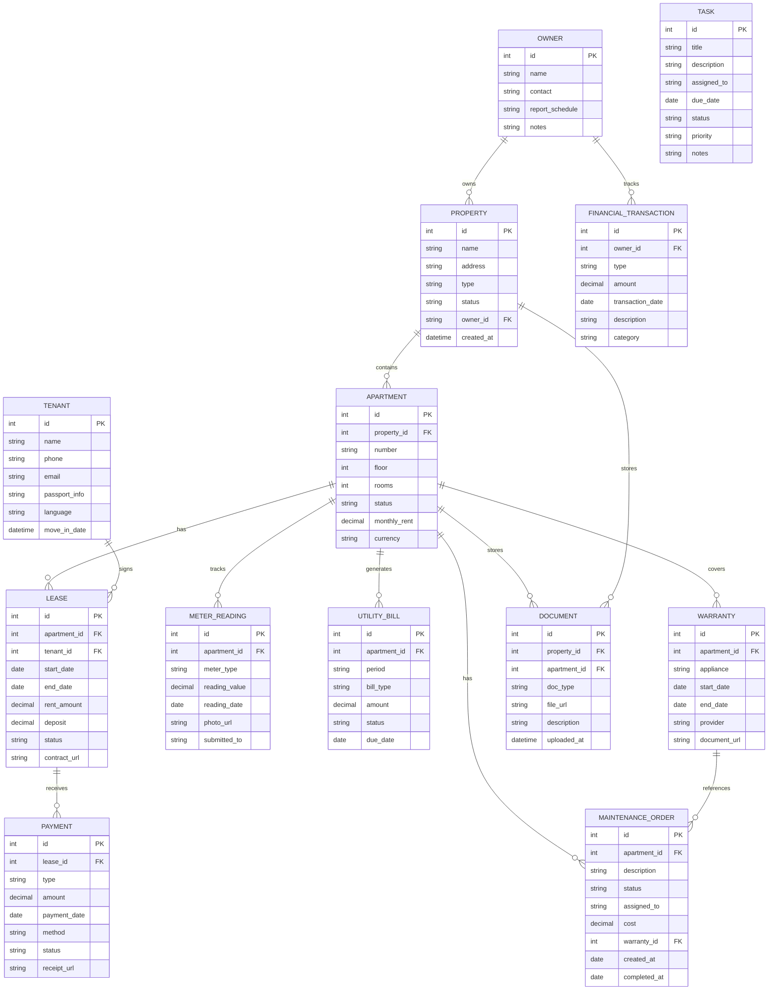

# DATA STRUCTURE: Apartment-management-Odessa

> Database schema and entity relationships.
> The project dashboard renders the Mermaid diagram below.
> Update this file whenever the database schema changes.

---

<!-- DASHBOARD:DATA_STRUCTURE:START -->

<!-- DASHBOARD:DATA_STRUCTURE:END -->
