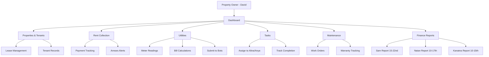

# PROJECT BRIEF: Apartment-management-Odessa

> Created: 2026-04-01 | Last Updated: 2026-04-01 | Status: 🟡 In Progress
> Repo: [https://github.com/care-prog/Apartment-management-Odessa]

---

## One-Liner

> All-in-one web + mobile dashboard for managing 19 rental apartments across Odessa, replacing fragmented Monday.com, Split, WhatsApp, and Excel workflows.

---

## Problem

**What problem does this solve:**
Property management operations are fragmented across 5+ tools (Monday.com, Split, WhatsApp, Excel, iCloud). The key supervisor (Katya) who holds critical operational knowledge is departing, creating a knowledge gap. No single system tracks properties, tenants, utilities, finances, maintenance, and tasks.

**Who has this problem:**
David (property owner managing 19 apartments remotely) and his on-site team of 2 managers (Alina weekdays, Anya weekends).

**How they currently deal with it:**
Manual processes — Monday.com for task automations, Split app for financial tracking, WhatsApp for communication, Excel for utility calculations, iCloud for photos/videos, personal memory for property-specific knowledge.

---

## Solution (MVP Only)

**Core features (max 5):**

1. Property & Tenant Dashboard — unified view of all 19 apartments, tenants, lease status
2. Rent & Utility Tracking — collection status, meter readings, bill calculations, arrears
3. Task Management — assign to managers, track completion, weekend handoffs
4. Maintenance Tracker — work orders, handyman contacts, warranty tracking
5. Financial Reports — per-owner income/expense summaries on scheduled dates

### Features

<!-- DASHBOARD:FEATURES:START -->
| Feature | Status | Phase | Description |
|---|---|---|---|
| Property Dashboard | 🟡 In Progress | 1 | Card grid of all 7 properties with occupancy, rent status, alerts |
| Tenant & Lease Management | 🔵 Planned | 1 | Tenant records, lease dates, contracts, renewal tracking |
| Rent Collection Tracker | 🔵 Planned | 1 | Monthly payment tracking, overdue alerts, payment history |
| Utility Management | 🔵 Planned | 1 | Meter readings, bill calculations, submission deadline tracking |
| Task Board | 🟡 In Progress | 1 | Assign tasks to Alina/Anya, track status, weekend handoffs |
| Maintenance & Repairs | 🔵 Planned | 1 | Work orders, handyman contacts, warranty tracking, cost logging |
| Owner Financial Reports | 🔵 Planned | 1 | Per-owner P&L (Sam, Natan, Eliahu, Haim), scheduled report dates |
| Document Storage | 🔵 Planned | 1 | Contracts, utility bills, photos, warranties organized by property |
| Emergency Handling | 🔵 Planned | 2 | After-hours issue tracking, key box locations, emergency contacts |
| Automated Notifications | 🔵 Planned | 2 | Telegram/WhatsApp bots for rent reminders, meter deadlines |
| Multi-language UI | 🔵 Planned | 2 | Russian, Hebrew (RTL), English interface |
| Role-based Access | 🔵 Planned | 2 | Owner vs manager views with different permissions |
| Mobile PWA | 🔵 Planned | 2 | Installable mobile app for field inspections |
| Camera Integration | 🅿️ Parking Lot | 3 | Real-time camera feed from properties |
<!-- DASHBOARD:FEATURES:END -->

Feature statuses: 🟢 Complete, 🟡 In Progress, 🔵 Planned, 🔴 Blocked, ⚪ Not Started

**What MVP does NOT include:**

- Multi-language UI (Phase 2)
- Automated WhatsApp/Telegram bots (Phase 2)
- Camera feed integration (Phase 3)
- Role-based access control (Phase 2)
- Airbnb/short-term rental management (deprecated)
- Payment processing integration

---

## Architecture

```
[Browser/Mobile] → [Flask API] → [SQLite DB]
       ↕                ↕
  [PWA Cache]     [File Storage]
```

**Key data flows:**

1. Manager logs meter reading → system calculates utility bill → sends to tenant
2. Rent due date arrives → system alerts manager → manager collects → marks paid
3. Something breaks → manager creates work order → tracks through completion

### Process Flow

<!-- DASHBOARD:PROCESS_FLOW:START -->

<!-- DASHBOARD:PROCESS_FLOW:END -->

---

## Phases

### Phase 0: Setup
- [x] Repo created from template
- [x] GitHub repo connected
- [x] SSH keys configured
- [ ] Tech stack confirmed
- [ ] Dev environment ready

### Phase 1: MVP Core
- [x] Dashboard UI designed (index.html)
- [ ] Database schema defined
- [ ] Property & tenant CRUD
- [ ] Rent collection tracking
- [ ] Utility management
- [ ] Task board
- [ ] Maintenance tracker
- [ ] Owner financial reports
- [ ] MVP tested end-to-end
- [ ] MVP deployed

### Phase 2: Polish (define after Phase 1 is COMPLETE)
- [ ] Multi-language support (RU/HE/EN)
- [ ] Automated notifications (Telegram/WhatsApp)
- [ ] Role-based access
- [ ] Mobile PWA optimization
- [ ] Emergency handling module

### Phase 3: Scale (define later)
- [ ] Camera integration
- [ ] Advanced analytics
- [ ] API integrations

---

## Parking Lot

> Ideas that came up during building. NOT in current scope. Review after MVP ships.

| Idea | Source | Priority | Notes |
|---|---|---|---|
| Camera feed integration | Katya transcript | Low | Most cameras need maintenance first |
| Airbnb/short-term rental module | Historical | Low | Currently not doing short-term rentals |
| OLX auto-posting | Katya transcript | Medium | Currently manual via Anya |
| Tenant self-service portal | Design | Medium | Tenants pay/view bills online |

---

## Risks and Open Questions

| Risk / Question | Impact | Status | Resolution |
|---|---|---|---|
| Katya knowledge transfer incomplete | High | 🟡 In Progress | Captured in transcripts, need to verify details |
| Split app data migration | Medium | 🔲 Open | Need to export existing financial data |
| Monday.com automation migration | Medium | 🔲 Open | Need to replicate key automations |
| War situation affecting operations | High | 🟡 Active | Maintenance workers scarce, power outages |
| Gas utility calculation discrepancy (Kanatna) | Medium | 🔲 Open | Historical data mismatch, may need lawyer |

---

## Success Criteria

> How do you know MVP is done?

- [ ] All 19 apartments visible in dashboard with correct status
- [ ] Rent collection tracking works for all tenants
- [ ] Utility meter readings can be logged and bills calculated
- [ ] Tasks can be assigned to Alina and Anya with status tracking
- [ ] Maintenance work orders can be created and tracked
- [ ] Per-owner financial reports generate correctly
- [ ] Dashboard accessible on mobile (responsive)
- [ ] David can manage everything remotely without WhatsApp
