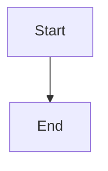

# PROJECT BRIEF: Apartment-management-Odessa

> Created: 2026-04-01 | Last Updated: 2026-04-01 | Status: 🔵 Planning
> Repo: [https://github.com/user/repo]

---

## One-Liner

> [What this project does in ONE sentence.]

---

## Problem

**What problem does this solve:**
[describe]

**Who has this problem:**
[target user in one sentence]

**How they currently deal with it:**
[existing solutions or workarounds]

---

## Solution (MVP Only)

**Core features (max 5):**

1. [Feature 1]
2. [Feature 2]
3. [Feature 3]

### Features

<!-- DASHBOARD:FEATURES:START -->
| Feature | Status | Phase | Description |
|---|---|---|---|
<!-- DASHBOARD:FEATURES:END -->

Feature statuses: 🟢 Complete, 🟡 In Progress, 🔵 Planned, 🔴 Blocked, ⚪ Not Started

**What MVP does NOT include:**

- [Explicitly list excluded features]
- [This prevents scope creep]

---

## Architecture

```
[User] → [Frontend] → [API] → [LLM] → [Response]
                         ↕
                     [Database]
```

**Key data flows:**

1. [Main user flow]
2. [Background/async processes if any]

### Process Flow

<!-- DASHBOARD:PROCESS_FLOW:START -->

<!-- DASHBOARD:PROCESS_FLOW:END -->

---

## Phases

### Phase 0: Setup
- [ ] Repo created from template
- [ ] Tech stack confirmed
- [ ] Dev environment ready
- [ ] API keys and accounts set up

### Phase 1: MVP Core
- [ ] Defined in TASK_PIPELINE.md
- [ ] MVP tested end-to-end
- [ ] MVP deployed

### Phase 2: Polish (define after Phase 1 is COMPLETE)

### Phase 3: Scale (define later)

---

## Parking Lot

> Ideas that came up during building. NOT in current scope. Review after MVP ships.

| Idea | Source | Priority | Notes |
|---|---|---|---|
| - | - | - | - |

---

## Risks and Open Questions

| Risk / Question | Impact | Status | Resolution |
|---|---|---|---|
| - | - | 🔲 Open | - |

---

## Success Criteria

> How do you know MVP is done?

- [ ] [Measurable criterion 1]
- [ ] [Measurable criterion 2]
- [ ] [Measurable criterion 3]
