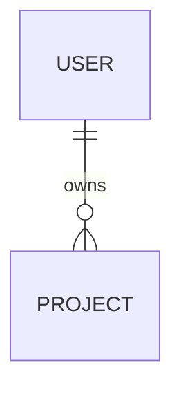
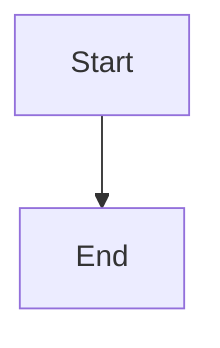

# ProjectOS Reference

> Detailed file formats, logging templates, testing procedures, and guidelines.
> Read this file when you need specific format details. Core rules are in `CLAUDE.md`.

---

## File Formats

Follow these exact formats so the project dashboard can parse them. **All timestamps use `YYYY-MM-DD HH:MM` format.**

### docs/TASK_PIPELINE.md
```
<!-- DASHBOARD:TASKS:START -->
| Task | Stage | Phase | Blocked By | Notes |
|---|---|---|---|---|
| [task name] | ⚪ To Do | Phase 1 | - | [notes] |
<!-- DASHBOARD:TASKS:END -->
```
Stages: ⚪ To Do, 🔍 Audit, 🟡 UI First, 🔵 Built (with tests), 🟢 Tested, 📝 Documented, 🟣 Deployed, 🔴 Blocked

### docs/TECH_STACK.md
```
<!-- DASHBOARD:STACK:START -->
| Tool | Category | Version | Status | Notes |
|---|---|---|---|---|
| [tool] | [category] | [version] | ✅ Ready | [notes] |
<!-- DASHBOARD:STACK:END -->
```
Categories: AI/LLM, Frontend, Backend, Database, Auth, Hosting, APIs, DevTools, Monitoring
Statuses: ✅ Ready, 🔧 In Setup, 🔲 Not Set Up, 🅿️ Parking Lot

**Stack Details** (for tools with APIs, accounts, or cost tracking):
```
<!-- DASHBOARD:STACK_DETAILS:START -->
### [Tool Name]
- **Uses API:** Yes/No
- **API Key Expires:** YYYY-MM-DD or N/A
- **Account:** [email or username]
- **Purpose:** [what it's used for]
- **Started:** YYYY-MM-DD
- **Ended:** - or YYYY-MM-DD
- **Monthly Cost:** [estimate or N/A]
<!-- DASHBOARD:STACK_DETAILS:END -->
```

**Schedules** (for cron jobs, webhooks, automated sync, workers):
```
<!-- DASHBOARD:SCHEDULES:START -->
| Name | Type | Frequency | Last Run | Next Run | Status |
|---|---|---|---|---|---|
| [Job name] | Cron/Webhook/Worker | [frequency] | YYYY-MM-DD HH:MM | YYYY-MM-DD HH:MM | ✅ Active / ⏸️ Paused / ❌ Disabled |
<!-- DASHBOARD:SCHEDULES:END -->
```

**Health Report** (auto-generated by daily health check — do not edit manually):
```
<!-- DASHBOARD:HEALTH:START -->
| Check | Status | Details | Last Checked |
|---|---|---|---|
| [check name] | PASS/WARN/FAIL | [details] | YYYY-MM-DD HH:MM |
<!-- DASHBOARD:HEALTH:END -->
```
Checks: File existence, Dashboard markers, Session log freshness, Git log maintenance, Task pipeline health, Tech stack completeness, CLAUDE.md integrity, Schedule health

**Audit Report** (auto-generated by daily code audit — do not edit manually):
```
<!-- DASHBOARD:AUDIT:START -->
| Check | Status | Value | Threshold | Details | Last Audited |
|---|---|---|---|---|---|
| [check name] | PASS/WARN/FAIL | [raw value] | [threshold description] | [command used] | YYYY-MM-DD HH:MM |
<!-- DASHBOARD:AUDIT:END -->
```
Checks: TypeScript Errors, Lint Issues, TODO/FIXME Count, Test Results, Security Audit, Unused Dependencies, Bundle Size, Code Duplication, File Organization

**Audit History** (compact daily history — auto-generated):
```
<!-- DASHBOARD:AUDIT_HISTORY:START -->
| Date | Grade | TS Errors | Lint | TODOs | Tests | Security | Unused Deps | Bundle | Duplicates | File Org |
|---|---|---|---|---|---|---|---|---|---|---|
| YYYY-MM-DD | A-F | [value] | [value] | [value] | [value] | [value] | [value] | [value] | [value] | [value] |
<!-- DASHBOARD:AUDIT_HISTORY:END -->
```
Grades: A = all pass, B = 1-2 warns, C = 3+ warns, D = 1-2 fails, F = 3+ fails

**Feature Audits** (pre-development audit results per task — auto-generated):
```
<!-- DASHBOARD:FEATURE_AUDITS:START -->
| Task | Grade | Security | Tests | Duplication | Complexity | Date |
|---|---|---|---|---|---|---|
| [task name] | A-F | [issue count] | [coverage] | [dup count] | [max file lines] | YYYY-MM-DD |
<!-- DASHBOARD:FEATURE_AUDITS:END -->
```
Individual audit reports stored at `docs/audits/{task-slug}-pre-audit.md`.

### docs/DECISIONS.md
```
<!-- DASHBOARD:DECISIONS:START -->
## [YYYY-MM-DD HH:MM] Decision Title

**Context:** Why this came up
**Options:**
1. Option A — pros / cons
2. Option B — pros / cons

**Decision:** What was chosen and why
**Consequences:** What this enables or constrains
<!-- DASHBOARD:DECISIONS:END -->
```

### docs/SESSION_LOG.md
Newest entries at the TOP. Two types of entries:

**Per-task entries** (logged after each completed task):
```
### [YYYY-MM-DD HH:MM] Task: [name]
**Stage:** [from] → [to]
**What was done:** [1-3 bullet points]
**Files changed:** [list key files]
**Decisions made:** [any, or "none"]
**Issues encountered:** [any, or "none"]
**Test results:** [pass/fail + details]
```

**Session summaries** (logged at end of conversation):
```
## [YYYY-MM-DD HH:MM] Session Summary
**Duration:** [approx time]
**Tasks completed:** [count and names]
**Current state:** [what's working, what's in progress]
**Next steps:**
1. [specific action]
2. [specific action]
3. [specific action]
**Open questions:** [any]
```

### docs/GIT_LOG.md
Newest entries at the top. Updated after every commit.
```
<!-- DASHBOARD:GIT_LOG:START -->
| Hash | Date | Message | Phase | Files Changed |
|---|---|---|---|---|
| [short hash] | [YYYY-MM-DD HH:MM] | [commit message] | [phase] | [count] |
<!-- DASHBOARD:GIT_LOG:END -->
```

### docs/DATA_STRUCTURE.md
Mermaid ER diagram. Updated whenever database schema changes.
```
<!-- DASHBOARD:DATA_STRUCTURE:START -->

<!-- DASHBOARD:DATA_STRUCTURE:END -->
```

### docs/PROJECT_BRIEF.md (dashboard sections)
**Repo URL** (header line): `> Repo: [https://github.com/user/repo]`

**Features table:**
```
<!-- DASHBOARD:FEATURES:START -->
| Feature | Status | Phase | Description |
|---|---|---|---|
| [feature] | 🟢 Complete | Phase 1 | [description] |
<!-- DASHBOARD:FEATURES:END -->
```
Feature statuses: 🟢 Complete, 🟡 In Progress, 🔵 Planned, 🔴 Blocked, ⚪ Not Started

**Process flow** (Mermaid flowchart):
```
<!-- DASHBOARD:PROCESS_FLOW:START -->

<!-- DASHBOARD:PROCESS_FLOW:END -->
```

---

## Logging Formats

### Status Snapshot (every 3-5 tasks)
```
=== STATUS SNAPSHOT [YYYY-MM-DD HH:MM] ===
Project: [name]
Phase: [current phase] — [X of Y tasks done]
Overall: [percentage complete]
Tech stack issues: [any not set up yet]
Blockers: [any]
AI costs this phase: [estimated if applicable]
Next 3 tasks: [list]
===
```

### Recovery Checklist (on any failure)
```
⚠️ [PROCESS] FAILED at [YYYY-MM-DD HH:MM]
Error: [one-line summary]

Checklist:
□ [Most likely fix]
□ [Second most likely fix]
□ [Check if dependency/service is running]
□ [Manual fallback option]

To retry: [exact command or action]
```

### Blocked Task Format
```
⚠️ BLOCKED: [task name]
Attempts: 3
Last error: [description]

Recovery options:
□ [Specific action 1]
□ [Specific action 2]
□ [Specific action 3]
□ [Escalation — "This may need manual intervention: [details]"]
```

---

## AI Development Guidelines

### Prompt Management
- Store all prompts in `prompts/` with clear filenames: `[feature]-[version].md`
- Every prompt file includes metadata: model, temperature, max tokens, purpose
- When a prompt works well, tag it as `stable` — never modify a stable prompt without creating a new version
- Keep a `prompts/CHANGELOG.md` tracking what changed and why

### Model Selection with A/B Comparison
When choosing a model for a new AI feature:
1. Default to the cheapest tier that could work:
   - **Haiku** — classification, extraction, simple formatting, routing
   - **Sonnet** — general coding, analysis, content generation, moderate reasoning
   - **Opus** — complex reasoning, nuanced writing, architecture decisions, multi-step planning

2. **If quality is uncertain**, run an A/B comparison:
   - Take 3 representative inputs for the feature
   - Run them through 2 model tiers (e.g., Haiku vs Sonnet)
   - Present both outputs side-by-side:
     ```
     === MODEL COMPARISON: [feature name] ===
     Input: "[sample input]"

     --- Haiku (est. $X.XX/1K requests) ---
     [output]

     --- Sonnet (est. $X.XX/1K requests) ---
     [output]

     Quality difference: [notable/marginal/none]
     Cost difference: [X]x more expensive
     Recommendation: [which model and why]
     ===
     ```
   - Let the user make the final call
   - Log the decision in `docs/DECISIONS.md` with comparison results

3. Document model choice in the feature doc with rationale.

### AI Error Handling
- Always handle: rate limits, timeout, empty responses, malformed outputs
- Use structured output (JSON mode) whenever possible for parseability
- Implement retry with exponential backoff for transient errors
- Log all AI failures to help debug prompt issues
- For user-facing AI: always have a graceful fallback message

---

## Testing Procedures

### Unit & Integration Tests
- Write tests alongside code, never after
- Run tests before marking any task as 🔵 Built
- All tests must pass before marking as 🟢 Tested

### Visual & E2E Testing
For every UI feature, before marking as 🟢 Tested:
1. Start the dev server
2. Navigate to the feature
3. Take a screenshot — verify layout and appearance
4. Use page snapshot — verify elements exist, correct text, proper structure
5. Test interactions — click buttons, submit forms, verify responses
6. Test edge cases — empty states, error states, loading states
7. Record results in the task log

### AI Feature Testing
- Run with real inputs, not just mocks
- Test against evaluation criteria defined in the feature doc
- Verify error handling: rate limits, timeouts, bad inputs
- Test output quality with at least 5 diverse inputs
- Log all test results with timestamps

---

## Multi-Session Protocol (Full Details)

**On conversation start:**
1. Generate a unique session ID (e.g., `session-{random-4-chars}`)
2. Read `.claude/active-sessions.json` (create if missing)
3. Register your session with current task and focus area
4. Check for conflicts — if another session is working on overlapping files, warn the user

**Session lock file** (`.claude/active-sessions.json` — gitignored):
```json
{
  "sessions": [
    {
      "id": "session-a1b2",
      "task": "Build user auth flow",
      "focus": ["src/auth/", "docs/TASK_PIPELINE.md"],
      "started": "2026-03-13 10:00",
      "pid": 12345
    }
  ]
}
```

**Rules:**
- Before editing a file, check if another session has it in their `focus` array
- If conflict: STOP and say "CONFLICT: session {id} is working on {file}."
- When wrapping up, deregister your session
- Stale sessions (>24 hours) can be cleaned up automatically
- Task claiming: add `[session-{id}]` to the Notes column in TASK_PIPELINE.md

---

## Project Structure

```
├── CLAUDE.md              ← Project rules (compact — see REFERENCE.md for details)
├── Makefile               ← Task runner: make setup, make dev, make deploy
├── index.html             ← Project dashboard (GitHub Pages, auto-reads markdown)
├── README.md              ← Project overview
├── .env.example
├── .template-version      ← Template version this project was created from
├── docs/                  ← Project management (you maintain these)
│   ├── PROJECT_BRIEF.md   (+ features table, repo URL, process flow)
│   ├── TASK_PIPELINE.md
│   ├── TECH_STACK.md       (+ stack details section)
│   ├── SESSION_LOG.md
│   ├── DECISIONS.md
│   ├── GIT_LOG.md          ← Commit history for dashboard
│   ├── DATA_STRUCTURE.md   ← ER diagram (Mermaid)
│   ├── AUDIT_LOG.md        ← Daily code audit results (auto-generated)
│   ├── FEATURE_AUDITS.md   ← Pre-dev audit results (auto-generated)
│   └── audits/             ← Per-task pre-dev audit reports
├── documentation/         ← Code and feature docs
│   ├── features/          ← One doc per feature (required before 🟣 Deployed)
│   ├── automations/       ← One doc per automation
│   ├── api/               ← API endpoint docs
│   └── ai/                ← AI docs, REFERENCE.md, audit prompts
├── prompts/               ← Versioned AI prompts with metadata
├── src/                   ← All source code
├── tests/                 ← All tests
├── database/              ← Schema, migrations, seeds
│   ├── schema/
│   ├── migrations/
│   └── seeds/
├── scripts/               ← Setup, deploy, utility scripts
│   └── hooks/             ← ProjectOS enforcement hooks
└── .github/workflows/     ← CI/CD and GitHub Pages
```

---

## Git Conventions (Extended)

### Commit Format
`[tag] verb: short description`

### Valid Tags
| Tag | When to use |
|---|---|
| `phase1`, `phase2`, ... | Task work in that phase |
| `health` | Health check results |
| `audit` | Code audit results or pre-dev audits |
| `infra` | Infrastructure, deployment, CI/CD |
| `fix` | Bug fixes |
| `docs` | Documentation-only changes |
| `setup` | Project scaffolding, configuration |

### Examples
```
[phase1] built: user auth flow
[phase1] tested: user auth visual verification
[fix] resolved: login redirect loop
[health] check: daily health results
[audit] daily: code quality audit completed
[audit] pre-dev: task-name audit completed
[docs] updated: session log and pipeline
[infra] upgrade: ProjectOS v3.3.0
[setup] created: project scaffolded from template
```

### Commit Checklist
Every task commit should include:
- [ ] Source code changes
- [ ] `docs/SESSION_LOG.md` — task entry added
- [ ] `docs/TASK_PIPELINE.md` — stage updated
- [ ] `docs/GIT_LOG.md` — commit entry added
- [ ] `docs/PROJECT_BRIEF.md` — features table updated (if applicable)
